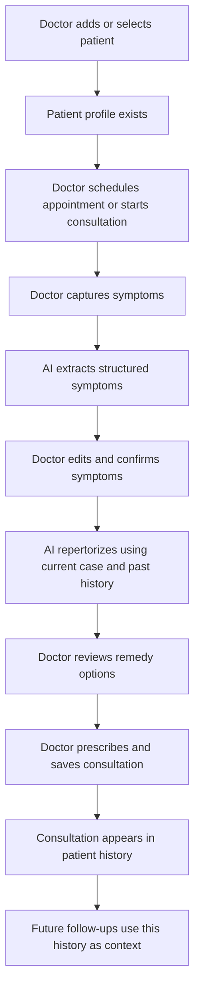

# VitalForce AI - Product Requirements Document

Updated: 2026-05-01

## 1. Product Summary

VitalForce AI is a homeopathic practice assistant for doctors. It helps a practitioner manage patients, capture case details, extract symptoms, receive AI-supported repertorization suggestions, save prescriptions, track consultation history, and schedule appointments.

The product is not a patient-facing app in its current form. The doctor is the primary user. Patients exist as records inside the doctor's workspace, and each patient's consultation history becomes the context for future follow-ups.

## 2. Product Purpose

Homeopathic consultations often require careful case taking, chronological history review, symptom grouping, remedy differentiation, and follow-up tracking. VitalForce AI reduces the administrative and cognitive load around that workflow by:

- Keeping patient details and consultation history in one place.
- Letting the doctor capture symptoms through voice, text, or image/report upload.
- Turning raw case input into structured homeopathic symptoms and rubrics.
- Suggesting remedies with reasoning, dosage, match percentage, and follow-up guidance.
- Using past consultations to make follow-up suggestions more context-aware.
- Supporting daily scheduling and quick access to patient records.

The doctor remains the final decision-maker. AI output is treated as decision support, not as an autonomous diagnosis or prescription.

## 3. Target Users

### 3.1 Doctor / Homeopathic Practitioner

The doctor is the active user of the application. They sign in, create and manage patient records, conduct consultations, review AI suggestions, prescribe remedies, and schedule appointments.

Primary goals:

- Start consultations quickly.
- Avoid losing patient history across visits.
- Get cleaner symptom extraction from messy notes, spoken narratives, or reports.
- Compare current complaints with previous remedies and outcomes.
- Save a usable record after each visit.

### 3.2 Patient

The patient is represented as a managed record. Patients do not currently sign in, edit their own profile, book appointments, or view prescriptions directly inside the app.

Patient information includes:

- Name
- Age
- Gender
- Phone
- Email
- Initial medical history
- Consultation timeline
- Prescribed remedies and notes from previous visits

### 3.3 AI Advisor

The AI advisor supports the doctor during case taking and reference lookup. Its role is to process clinical text, voice, and images into structured outputs that a doctor can review.

AI responsibilities:

- Extract homeopathic symptoms from text.
- Transcribe and extract symptoms from voice input.
- Analyze uploaded report or symptom images.
- Repertorize current symptoms.
- Compare current symptoms with previous consultations.
- Suggest top remedies and explain why they are ranked.
- Search Materia Medica and repertory references.

The AI does not own the clinical decision. The doctor reviews, edits, accepts, or ignores its output.

## 4. Product Scope

### 4.1 In Scope Now

- Doctor sign-in.
- Doctor-specific workspace.
- Dashboard with today's appointments and recent patients.
- Patient record creation, search, deletion, and history viewing.
- Consultation workflow for new cases and follow-ups.
- Symptom input through voice, typed text, and image upload.
- AI symptom extraction.
- AI repertorization with previous consultation context.
- Remedy suggestions with reasoning, dosage, match percentage, and follow-up timing.
- Saving consultation records to the selected patient.
- Appointment scheduling and cancellation.
- Materia Medica and repertory search.

### 4.2 Out of Scope Now

- Patient login or patient portal.
- Online booking by patients.
- Payment, billing, invoices, or subscriptions.
- Prescription printing or PDF export.
- Lab integration.
- Clinic staff/team roles.
- Multi-doctor shared clinic workflows.
- Appointment reminders by SMS, WhatsApp, or email.
- Outcome scoring and analytics.
- Formal consent flows or regulatory compliance workflows.

## 5. Core Product Components

### 5.1 Authentication

The app starts with a doctor sign-in screen. A doctor must sign in before seeing the application. Once signed in, the doctor gets access to their own workspace.

Product expectation:

- The doctor should only see their own patients, consultations, and appointments.
- The user profile is visible in the sidebar.
- The doctor can sign out from the app.

### 5.2 Dashboard

The Dashboard is the doctor's home screen. It answers: "What should I pay attention to today?"

It includes:

- Greeting for the signed-in doctor.
- Quick Materia Medica/repertory search.
- Prominent action to start a new consultation.
- Today's appointments.
- Recent patients.

Main actions:

- Start a new consultation.
- Open today's appointment and begin a consultation for that patient.
- Open a recent patient.
- Search Materia Medica or repertory.

### 5.3 Patients

The Patients area is the practice's patient registry.

It supports:

- Viewing all patients owned by the doctor.
- Searching by patient name or phone number.
- Adding a new patient.
- Opening a patient's details.
- Starting a follow-up consultation for a patient.
- Deleting a patient.

Patient details show:

- Basic profile information.
- Initial medical history.
- Registration date.
- Consultation count.
- Timeline of previous consultations.
- Recorded symptoms.
- Diagnosis/notes.
- Prescribed remedy and potency when available.

### 5.4 Consultation / Case Taking

The Consultation area is the main clinical workflow. It helps the doctor move from raw patient input to a saved visit record.

It supports:

- Selecting a patient.
- Loading that patient's previous consultations.
- Capturing symptoms through voice, text, or image/report upload.
- Reviewing and editing extracted symptoms.
- Running repertorization.
- Reviewing AI case analysis and remedy suggestions.
- Prescribing one suggested remedy and saving the consultation.

Important product rule:

- A consultation can be started before selecting a patient, but it cannot be saved until a patient is selected.

### 5.5 Calendar

The Calendar area helps the doctor manage appointments.

It supports:

- Selecting a calendar date.
- Viewing appointments for that date.
- Scheduling a new appointment for an existing patient.
- Adding appointment notes.
- Cancelling an appointment.

Appointment information includes:

- Patient
- Date
- Time
- Status
- Notes

Current appointment status is created as scheduled. The current product supports cancellation by deletion rather than a fuller status lifecycle.

### 5.6 Materia Medica & Repertory

The Materia Medica area is a reference search assistant. It lets the doctor ask natural-language questions about remedies, symptoms, rubrics, and indications.

Typical queries:

- "Burning soles of feet at night, worse from heat"
- "Compare Nux Vomica and Lycopodium for digestive complaints"
- "Remedies for anxiety before examination"

Output expectation:

- Concise summary.
- Relevant remedies.
- Indications and differentiating points.
- Text that helps the doctor reason, not a final prescription by itself.

## 6. Main User Flows

### 6.1 First-Time Doctor Flow

1. Doctor opens the app.
2. Doctor signs in.
3. App shows the Dashboard.
4. If there are no patients, the doctor goes to Patients and adds the first patient.
5. Doctor can then schedule an appointment or start a consultation.

### 6.2 Add Patient Flow

1. Doctor opens Patients.
2. Doctor selects Add Patient.
3. Doctor enters patient name.
4. Doctor optionally enters age, gender, phone, email, and initial medical history.
5. Doctor saves the patient.
6. Patient appears in the patient list and can be used for appointments or consultations.

Required information:

- Patient name.

Optional information:

- Age
- Gender
- Phone
- Email
- Initial medical history

### 6.3 New Consultation Flow

1. Doctor starts a new consultation from the sidebar, Dashboard, Patients page, or appointment.
2. Doctor selects the patient if not already pre-selected.
3. App loads the patient's past consultations.
4. Doctor captures current symptoms using one or more input methods:
   - Voice dictation
   - Typed notes
   - Uploaded image/report
5. AI extracts symptoms into a cleaner clinical symptom list.
6. Doctor reviews and edits the extracted symptoms.
7. Doctor clicks Repertorize.
8. AI analyzes:
   - Current extracted symptoms
   - Patient's previous consultation history
   - Previous prescribed remedies and notes
9. AI returns:
   - Case analysis and issue summary
   - Constitutional profile summary
   - Primary remedy
   - Alternative remedy
   - Differential remedy
   - Match percentage for each remedy
   - Reasoning
   - Dosage suggestion
   - Follow-up recommendation
   - Differentiation logic explaining why lower-ranked remedies were not primary
10. Doctor reviews the suggestions.
11. Doctor chooses a remedy and saves the consultation.
12. App returns to Patients, where the saved consultation is visible in the patient's history.

### 6.4 Follow-Up Consultation Flow

1. Doctor opens Patients.
2. Doctor finds the patient.
3. Doctor clicks Follow-up.
4. Consultation opens with the patient already selected.
5. App loads the patient's past consultations.
6. Doctor records new or changed symptoms.
7. AI compares the current case with the patient's prior timeline.
8. AI considers previous remedies and notes while suggesting the next remedy.
9. Doctor saves the follow-up consultation.
10. Patient history grows into a chronological treatment record.

Follow-up value:

- The doctor does not need to manually reconstruct the full case from memory.
- The AI can account for remedy response, changed symptoms, and recurring patterns.
- The patient's profile becomes more useful with every saved consultation.

### 6.5 Appointment Flow

1. Doctor opens Calendar.
2. Doctor selects a date.
3. Doctor clicks New Appointment.
4. Doctor selects an existing patient.
5. Doctor selects time and optionally adds notes.
6. Appointment appears on the selected day.
7. Dashboard shows today's appointments.
8. Doctor can start a consultation from an appointment.
9. Doctor can cancel an appointment.

### 6.6 Materia Medica Search Flow

1. Doctor enters a search query from Dashboard or Materia Medica.
2. App opens the Materia Medica search screen.
3. AI returns a homeopathic reference-style answer.
4. Doctor uses that answer as supporting information during study or consultation.

## 7. End-to-End Patient Journey Inside the App

This section explains what happens "when a patient is there" in the product.

In simple terms:

- A patient begins as a profile.
- The profile becomes useful when consultations are saved against it.
- Each saved consultation adds symptoms, remedy, dosage, reasoning, and follow-up notes.
- Follow-up visits become smarter because the product can reference the previous treatment timeline.

## 8. Product Data Concepts

This is a product-level explanation, not a technical schema.

### 8.1 Doctor

The owner of the workspace. All patients, appointments, and consultations belong to a doctor.

### 8.2 Patient

The person being treated. A patient has personal details, contact information, initial history, and consultation history.

### 8.3 Consultation

A single clinical visit or case-taking session. It stores what was observed, what symptoms were extracted, what AI suggested, what remedy was prescribed, and what follow-up was recommended.

### 8.4 Appointment

A scheduled time for a patient visit. Appointments help organize the doctor's day and provide an entry point into consultations.

### 8.5 Remedy Suggestion

An AI-generated recommendation set. It normally includes ranked options rather than a single answer so the doctor can compare possibilities.

### 8.6 Materia Medica Query

A standalone search or reference question. It does not automatically create a patient record or consultation.

## 9. Product Rules

- A doctor must be signed in to use the app.
- A doctor should only access their own records.
- A patient must exist before an appointment can be scheduled.
- Patient name is required.
- A consultation must have a selected patient before it can be saved.
- Symptoms can be edited before repertorization.
- AI suggestions should be reviewed by the doctor before being saved.
- Saved consultations become part of the patient's future clinical context.
- Deleting patients and cancelling appointments should require confirmation.

## 10. Key Screens

### 10.1 Sign-In Screen

Purpose:

- Protect the app and identify the doctor.

Primary action:

- Sign in with Google.

### 10.2 Dashboard

Purpose:

- Provide a daily practice overview and fast entry points.

Primary actions:

- Start consultation.
- View appointment.
- Open patient.
- Search Materia Medica.

### 10.3 Patients

Purpose:

- Manage patient records and inspect patient history.

Primary actions:

- Add patient.
- Search patient.
- Open patient details.
- Start follow-up.
- Delete patient.

### 10.4 Consultation

Purpose:

- Capture a case, use AI to structure it, and save a prescription-backed visit record.

Primary actions:

- Select patient.
- Capture symptoms.
- Extract symptoms.
- Repertorize.
- Prescribe and save.

### 10.5 Calendar

Purpose:

- Plan and manage patient visits.

Primary actions:

- Select date.
- Schedule appointment.
- Cancel appointment.

### 10.6 Materia Medica

Purpose:

- Search homeopathic references through natural language.

Primary actions:

- Search remedies, rubrics, symptoms, modalities, or comparisons.

## 11. User Experience Requirements

### 11.1 Speed

The doctor should be able to start a consultation within one click from the main layout.

### 11.2 Continuity

Patient history should stay connected to future consultations. Follow-up cases should not feel disconnected from earlier visits.

### 11.3 Reviewability

AI output must be visible and editable where appropriate before the doctor commits it to the patient's record.

### 11.4 Practical Empty States

The app should clearly handle:

- No patients yet.
- No appointments for a selected day.
- No consultations for a patient.
- No extracted symptoms yet.
- No Materia Medica result yet.

### 11.5 Clear Processing States

The app should show when it is processing:

- Voice input
- Text extraction
- Image analysis
- Repertorization
- Materia Medica search

### 11.6 Error Handling

The app should tell the doctor when:

- Microphone access fails.
- Audio processing fails.
- Image processing fails.
- Symptom extraction fails.
- Repertorization fails.
- A record cannot be saved.

## 12. AI Behavior Requirements

### 12.1 Symptom Extraction

AI should convert raw patient narration or doctor notes into a clean symptom list suitable for homeopathic reasoning.

Expected output:

- Key symptoms.
- Modalities where available.
- Rubric-like phrasing where useful.
- Plain text that the doctor can edit.

### 12.2 Repertorization

AI should analyze the current case and suggest ranked remedies.

Expected output:

- Summary of patient issues.
- Constitutional profile where inferable.
- Top 3 remedies:
  - Primary
  - Alternative
  - Differential
- Match percentage.
- Reasoning.
- Dosage guidance.
- Follow-up timing.
- Differentiation logic.

### 12.3 Follow-Up Context

When previous consultations exist, AI should use them to understand:

- Timeline of illness.
- Changes since previous visit.
- Remedies already prescribed.
- Notes or diagnosis from earlier visits.
- Whether current symptoms are new, recurring, improved, or changed.

### 12.4 Materia Medica Search

AI should provide concise, reference-style answers. It should help compare remedies and clarify indications without pretending to replace the doctor's judgement.

## 13. Safety and Clinical Positioning

VitalForce AI should be positioned as a professional support tool for qualified practitioners.

Safety principles:

- The doctor is responsible for final diagnosis and prescription.
- AI output is advisory.
- Suggested dosage and follow-up should be reviewed clinically.
- Patient history should be treated as sensitive health information.
- The app should avoid presenting AI recommendations as guaranteed outcomes.

Recommended future additions:

- In-app clinical disclaimer.
- Patient consent tracking.
- Audit history for record changes.
- Exportable patient record for clinic compliance.
- Clear emergency-care disclaimer for urgent symptoms.

## 14. Current Limitations

- No patient portal.
- No appointment completion workflow beyond scheduling and cancellation.
- No built-in prescription printout.
- No PDF export of consultation history.
- No billing or payment workflow.
- No reminders.
- No staff/admin roles.
- No outcome tracking, severity scoring, or progress charts.
- No explicit consent management.
- No offline mode.
- No direct integration with external repertory databases.

## 15. Suggested Next Product Milestones

### Milestone 1: Make Consultations More Complete

- Add manual remedy entry in case the doctor wants to prescribe something outside AI suggestions.
- Add consultation status: draft, completed.
- Add editable final prescription notes.
- Add print or export prescription.

### Milestone 2: Improve Follow-Ups

- Add patient progress notes.
- Track response to previous remedy.
- Add symptom severity before and after treatment.
- Show chronological patient timeline more prominently.

### Milestone 3: Improve Appointments

- Add appointment statuses: scheduled, checked in, completed, cancelled, no-show.
- Link completed appointment to saved consultation.
- Add reminders.

### Milestone 4: Patient Communication

- Add prescription sharing.
- Add follow-up reminders.
- Add optional patient intake form.
- Add consent capture.

### Milestone 5: Practice Operations

- Add billing.
- Add clinic staff roles.
- Add exports for records.
- Add analytics for visits, follow-ups, and common remedies.

## 16. Success Metrics

Product success can be measured by:

- Time from opening app to starting a consultation.
- Number of patients added.
- Number of consultations saved per patient.
- Percentage of consultations that include saved remedy and follow-up.
- Usage of follow-up workflow versus one-off consultations.
- Number of Materia Medica searches during active use.
- Reduction in unsaved or incomplete consultation records.
- Doctor satisfaction with AI suggestion quality.

## 17. MVP Acceptance Criteria

The current MVP should be considered functional when:

- A doctor can sign in.
- A doctor can add a patient.
- A doctor can schedule an appointment for that patient.
- Today's appointment appears on Dashboard.
- A doctor can start a consultation for that patient.
- A doctor can enter symptoms through at least one input method.
- AI can extract symptoms.
- Doctor can edit extracted symptoms.
- AI can generate ranked remedy suggestions.
- Doctor can save a prescribed remedy to the patient.
- The saved consultation appears in patient history.
- A later follow-up uses the patient's previous consultations as context.
- The doctor can search Materia Medica separately from a patient consultation.

## 18. Product Narrative

VitalForce AI is designed around the working rhythm of a homeopathic doctor. The day starts on the Dashboard, where the doctor sees appointments and recent patients. When a patient arrives, the doctor either opens an appointment, chooses the patient from the patient list, or starts a new consultation directly.

During the consultation, the doctor captures the patient's story in the fastest available form: speaking, typing, or uploading a report/image. The app turns that raw material into organized symptoms. The doctor edits the symptoms, asks for repertorization, and receives ranked remedy suggestions with reasoning.

The doctor chooses what to prescribe. Once saved, the consultation becomes part of the patient's history. On the next visit, the app does not treat the case as new. It brings forward the previous symptoms, prescriptions, notes, and timeline so the follow-up can be reasoned from the whole case, not just the latest complaint.

That is the core product loop: patient record, consultation, AI-assisted reasoning, doctor decision, saved history, stronger follow-up.
